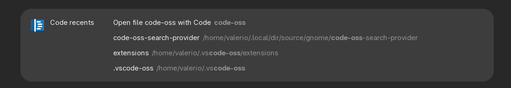

# gnome-code-oss-search-provider



It provides Code-OSS search with completion for the GNOME Shell, and leverages the `workspaceStorage` database.

For this reason it is a good idea to keep it clean. Here is a convenient script that helps you to choose which files to delete, with the aid of `fzf`.

```bash
#!/bin/bash

WORKSPACE_DIR="$HOME/.config/Code - OSS/User/workspaceStorage/"

cd "$WORKSPACE_DIR"
SELECTED=$(for d in *; do
	FILE=$(cat $d/workspace.json | jq .folder)
	if [[ $FILE == "null" ]];
	then
		continue;
	else
	FILE=$(sed 's/file:\/\///g' <<< $FILE)
	echo $d $FILE
	fi
done | fzf | cut -d ' ' -f 1)

if [[ -n "$SELECTED" ]];
then
	DELETE=$(echo -e "yes\nno" | fzf)
	if [[ $DELETE == "yes" ]];
	then
		rm -rf "$WORKSPACE_DIR$SELECTED"
	fi
fi
```

# Installation

Ensure that python>=3.7 as well as the dbus, gobject and  duckduckgo_search Python modules are installed. They should all be packaged under python-name or python3-name depending on your distribution.

Clone this repository and run the installation script as root:
```
git clone https://github.com/iacobucci/gnome-duckduckgo-search-provider.git
cd gnome-pass-search-provider
sudo ./install.sh
```

## Post-installation

Log out and reopen your GNOME session.

The search provider will be loaded automatically when doing a search.

You should see it enabled in GNOME Settings, in the Search pane. This is also where you can move it up or down in the list of results relatively to other search providers.

## Other problems

If you encounter problems, make sure to look in the logs of GNOME and D-Bus. On systems that use systemd, you can do this using `journalctl --user`.

Don't hesitate to open an issue.
